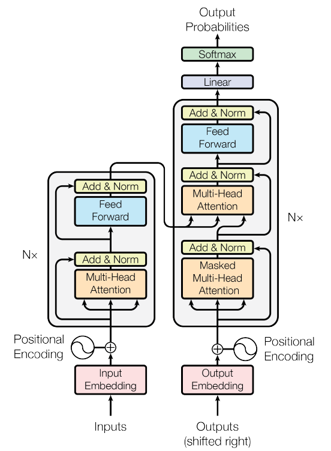

## Transformer

**Coming soon...**

Unofficial code for the original paper [Attention is all you need](https://arxiv.org/pdf/1706.03762.pdf) by  Ashish Vaswani et al.

## TODO
- [x] Sublayer Residual Connection
- [x] Encoder Layer
- [x] Encoder
- [x] Decoder Layer
- [x] Decoder
- [x] Multi-Head Attention
- [x] Position-wise Fully Connected Feed-Forward Network
- [x] Positional Encoding
- [x] Embedding
- [x] PyTorch Transformer
- [ ] Training Data
- [ ] Utils
- [ ] Training Scripts
- [ ] Train
- [ ] JAX implementation

## Acknowledgements

I was heavily inspired by
* The original paper **Attention Is All You Need** by Ashish Vaswani et al., see [here](https://arxiv.org/pdf/1706.03762.pdf)
* **OpenNMT: Open-Source Toolkit for Neural Machine Translation** by Guillaume Klein et al., see [here](http://nlp.seas.harvard.edu/2018/04/03/attention.html)
* **Illustrated Attention** by Raimi Karim, see [here](https://towardsdatascience.com/attn-illustrated-attention-5ec4ad276ee3#d442)
* **pytorch-original-transformer** by Aleksa Gordić, see [here](https://github.com/gordicaleksa/pytorch-original-transformer)

## License

